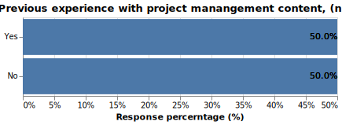
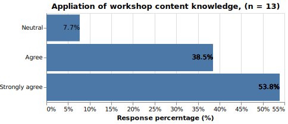

## Overview 

This report contains visualizations of survey questions from Pre and Post WS Survey questionnaire. The statistics shown here reflect response from 13 participants who responded to the post-workshop survey and 6 participant responses in pre-workshop survey. 

## Pre-Survey Results   

Visualizations of all multiple choice or selection-based questions in Pre-workshop survey:   

#### Q1: Do you consider yourself to be one or more of the following roles (please select all that apply)

```{r pq1}
#| echo=FALSE, 
#| out.width = '75%'


```


#### Q2: Have you ever attended a course or viewed an educational webinar about project management?   

```{r pq2}
#| echo=FALSE, 
#| out.width = '75%'


```


#### Q3: At work are you typically focused on one project at a time or multiple projects?  

- All 6 respondents responded with `Multiple Porojects`.  


#### Q4: Approximately how many team members, including you, will be active on that particular project?   

```{r p7}
#| echo=FALSE, 
#| out.width = '75%'


```

## Post-Survey Results

Visualizations of all multiple choice or selection-based questions in Post-workshop survey: 

### Content-based questions:  

#### Q11: The Workshop content sustained my interest

```{r q1}
#| echo=FALSE, 
#| out.width = '75%'


```


#### Q2: The Workshop content was easy to understand  

```{r q2}
#| echo=FALSE, 
#| out.width = '75%'


```


#### Q3: The Workshop content was relevant to my current job  

```{r q3}
#| echo=FALSE, 
#| out.width = '75%'


```


#### Q4: The Workshop content was relevant to my Organization  

```{r q4}
#| echo=FALSE, 
#| out.width = '75%'


```


#### Q5: The optional practice exercises helped me understand the Workshop content

```{r q5}
#| echo=FALSE, 
#| out.width = '75%'


```


#### Q6: I will be able to apply the knowledge from these Workshop sessions in the future

```{r q6}
#| echo=FALSE, 
#| out.width = '75%'


```


#### Q7: How would you rate the volume of information presented in this one-hour session?

```{r q7}
#| echo=FALSE, 
#| out.width = '75%'


```


#### Q11: What HOURS do you recommend for future training sessions?  Please include hours that you personally prefer in the "other" box below.

```{r q11}
#| echo=FALSE, 
#| out.width = '75%'


```

### Facilitator-specific questions:  

#### Q13: Facilitators were well prepared

```{r q12}
#| echo=FALSE, 
#| out.width = '75%'


```


#### Q14: Were able to answer my questions

```{r q14}
#| echo=FALSE, 
#| out.width = '75%'


```


#### Q15: Provided real world experience

```{r q15}
#| echo=FALSE, 
#| out.width = '75%'


```


#### Q16: Possessed knowledge of the subject matter

```{r q16}
#| echo=FALSE, 
#| out.width = '75%'


```


#### Q17: Were able to hold my attention

```{r q17}
#| echo=FALSE, 
#| out.width = '75%'


```


#### Q18: How would you rate the pace of content delivery in this 90 minute session?

```{r q18}
#| echo=FALSE, 
#| out.width = '75%'


```

### General questions:  

#### Q19: Do you plan to subscribe to our mailing list to receive news about upcoming workshops and/or project volunteer opportunities?

```{r q19}
#| echo=FALSE, 
#| out.width = '75%'


```


#### Q20: When you register for professional development, do you prefer weekday or weekend sessions or the option for both?

```{r q20}
#| echo=FALSE, 
#| out.width = '75%'


```

