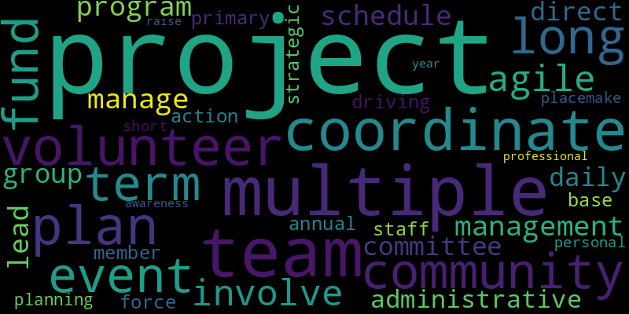

```{r setup, include=FALSE}
knitr::opts_chunk$set(echo = FALSE)
library(knitr)
library(kableExtra)
library(tidyverse)
```


## Overview 

This report contains visualizations of open-text survey questions from Pre and Post WS Survey questionnaire. The statistics shown here reflect response from 13 participants who responded to the post-workshop survey and 6 participant responses in pre-workshop survey. 

## Pre-Survey Results   

Visualizations of all text response questions:  

#### Q4:  If multiple projects, please describe or type N/A for not applicable?

```{r pq1}
table1 <- read_csv("../results/tables/pre_survey_q4.csv") |>
  suppressMessages() 
  
kable(table1, 
      caption = "Key terms from participant personal projects", 
      align = "ll") |> kable_styling(font_size = 13)
```

```{r}
#| echo=FALSE, 
#| out.width = '65%'


```


#### Q5: Briefly describe one project (3-5 sentences) that you are currently involved with, or that you anticipate working on in the near future.  

```{r pq2}
table2 <- read_csv("../results/tables/pre_survey_q5.csv") |>
  suppressMessages() 
  
kable(table2, 
      caption = "Key terms from one participant project", 
      align = "ll") |> kable_styling(font_size = 13)
```

<br>

```{r pq2.1}
#| echo=FALSE, 
#| out.width = '65%'


```


#### Q7: Please describe any areas of TEAM strength you have identified.   

```{r pq 3}
table3 <- read_csv("../results/tables/pre_survey_q7.csv") |>
  suppressMessages() 
  
kable(table3, 
      caption = "Key terms from areas of team strength ", 
      align = "ll") |> kable_styling(font_size = 13)
```


```{r 3.1}
#| echo=FALSE, 
#| out.width = '65%'


```


#### Q4: What common and/or recurring issues and challenges do you encounter while being part of a project? (list and briefly describe TOP three if you can)    

```{r 4.1}
table4 <- read_csv("../results/tables/pre_survey_q8.csv") |>
  suppressMessages() 
  
kable(table4, 
      caption = "Key terms related to common areas of challenges in participant projects", 
      align = "ll") |> kable_styling(font_size = 13)
```


```{r 4.2}
#| echo=FALSE, 
#| out.width = '75%'


```

## Post-Survey Results

Visualizations of all open-text responses in Post-workshop survey: 

### Content-based questions:  

#### Q8: Please describe any recommendations for improvements to this Online Workshop Session?

```{r q1}
#| echo=FALSE, 
#| out.width = '75%'

knitr::include_graphics("../results/images/post_q8_wc.png")
```


```{r}
table5 <- read_csv("../results/tables/post_survey_q8.csv") |>
  suppressMessages() 
  
kable(table5, 
      caption = "Key terms related to recommendations for improvements to the Online Workshop Session", 
      align = "ll") |> kable_styling(font_size = 13)
```


```{r}
table6 <- read_csv("../results/tables/post_phrase_q8.csv") |>
  suppressMessages() 
  
kable(table6, 
      caption = "Phrase-matched terms for workshop session improvement recommendations", 
      align = "ll") |> kable_styling(font_size = 13)
```


#### Q9: Please share any other comments relating to this Online Workshop content¶   

```{r q2}
#| echo=FALSE, 
#| out.width = '75%'

knitr::include_graphics("../results/images/post_q9_wc.png")
```

```{r}
table7 <- read_csv("../results/tables/post_survey_q9.csv") |>
  suppressMessages() 
  
kable(table7, 
      caption = "Key terms from online workshop content related comments", 
      align = "ll") |> kable_styling(font_size = 13)
```

```{r}
table8<- read_csv("../results/tables/post_phrase_q9.csv") |>
  suppressMessages() 
  
kable(table8, 
      caption = "Phrase-matched terms for workshop session related comments", 
      align = "ll") |> kable_styling(font_size = 13)
```

#### Q12: The "Introduction to Project Management for Non-Profits" workshop is a high-level overview of project management. We are in the process of planning future topics for online workshops.

```{r q3}
#| echo=FALSE, 
#| out.width = '75%'


```

```{r}
table9 <- read_csv("../results/tables/post_survey_q12.csv") |>
  suppressMessages() 
  
kable(table9, 
      caption = "Key terms from online workshop content related comments", 
      align = "ll") |> kable_styling(font_size = 13)
```


```{r}
table10 <- read_csv("../results/tables/post_phrase_q12.csv") |>
  suppressMessages() 
  
kable(table10, 
      caption = "Phrase matched terms from online workshop content related comments", 
      align = "ll") |> kable_styling(font_size = 13)
```


#### Q4: Additional comments relating to the Facilitator(s)?   

```{r q4}
#| echo=FALSE, 
#| out.width = '75%'

knitr::include_graphics("../results/images/post_19_wc.png")
```


```{r}
table11 <- read_csv("../results/tables/post_survey_q19.csv") |>
  suppressMessages() 
  
kable(table11, 
      caption = "Key terms related to comments about facilitators", 
      align = "ll") |> kable_styling(font_size = 13)
```


```{r}
table12<- read_csv("../results/tables/sent_analysis.csv") |>
  suppressMessages() 
  
kable(table12, 
      caption = "Sentiment analysis of comments about workshop facilitators. A positive score between 0 and 1 indicates positive comments, and value between 0 and -1 relates to negative comments.", 
      align = "ll") |> kable_styling(font_size = 13)
```

#### Q20: Please describe any recommendations for SLACK that could help connect participants with each other and PMV Facilitators during this session?  

```{r}
table13<- read_csv("../results/tables/q20_responses.csv") |>
  suppressMessages() 
  
kable(table13, 
      caption = "Processed version of slack recommendation responses", 
      align = "ll") |> kable_styling(font_size = 13)
```

```{r q6}
#| echo=FALSE, 
#| out.width = '75%'


```


```{r}
table14<- read_csv("../results/tables/post_survey_q20.csv") |>
  suppressMessages() 
  
kable(table14, 
      caption = "Key terms related to slack recoomendations", 
      align = "ll") |> kable_styling(font_size = 13)
```


#### Q7: As a volunteer-based organization, PMV does not have an advertising budget so we are always looking for personal comments we can use on our website or social media.

```{r q7}
#| echo=FALSE, 
#| out.width = '75%'

knitr::include_graphics("../results/images/post_q22_wc.png")
```


```{r q11}
table15<- read_csv("../results/tables/post_survey_q22.csv") |>
  suppressMessages() 
  
kable(table15, 
      caption = "Key terms related to comments regarding website or social media", 
      align = "ll") |> kable_styling(font_size = 13)
```

