```{r setup, include=FALSE}
knitr::opts_chunk$set(echo = FALSE)
library(knitr)
library(kableExtra)
library(tidyverse)
```


## Overview 

This report contains visualizations of open-text survey questions from Post WS Survey questionnaire. 

### Content-based questions:  

#### Q1: Please describe any recommendations/comments for improvements to this Online Workshop Session?


```{r}
table5 <- read_csv("../results/tables/online_wksp_rec.csv") |>
  suppressMessages() 
  
kable(table5, 
      caption = "Common topics related to recommendations on online workshop session", 
      align = "ll") |> kable_styling(font_size = 13)
```


#### Q2: The "Introduction to Project Management for Non-Profits" workshop is a high-level overview of project management. We are in the process of planning future topics for online workshops.  

```{r}
table7 <- read_csv("../results/tables/future_topics.csv") |>
  suppressMessages() 
  
kable(table7, 
      caption = "Common Future topics recommended by participants", 
      align = "ll") |> kable_styling(font_size = 13)
```


#### Q3: Recommendations for improvement when using SLACK to connect participants with each other and PMV Facilitators during this session?

```{r}
table9 <- read_csv("../results/tables/slack_Recm.csv") |>
  suppressMessages() 
  
kable(table9, 
      caption = "Common slack recommendations and comments", 
      align = "ll") |> kable_styling(font_size = 13)
```


#### Q4: Additional comments relating to the Facilitator(s)?   


```{r}
table11 <- read_csv("../results/tables/fac_com.csv") |>
  suppressMessages() 
  
kable(table11, 
      caption = "Common topics related to comments about facilitators", 
      align = "ll") |> kable_styling(font_size = 13)
```

#### Q5: We are also in the process of  planning shorter, Advanced Workshop sessions. Which of the topics listed below would encourage you to register for future workshops with PMV?

```{r q6}
#| echo=FALSE, 
#| out.width = '75%'

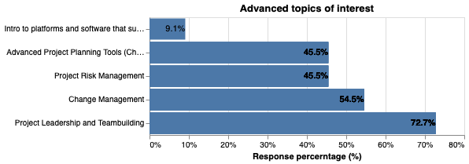
```


#### Q6: Would you prefer to attend online or in-person workshops with PMV?  You are welcome to share comments in the "other" box below.

```{r q7}
#| echo=FALSE, 
#| out.width = '75%'

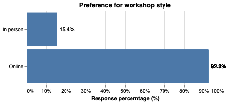
```


#### Q7: At the beginning of this Workshop, we invited you to join the Alumni Channel in SLACK to network with each other plus PM-Volunteers and other members in the NFP Community who attend PMV workshops....


```{r q8}
#| echo=FALSE, 
#| out.width = '75%'

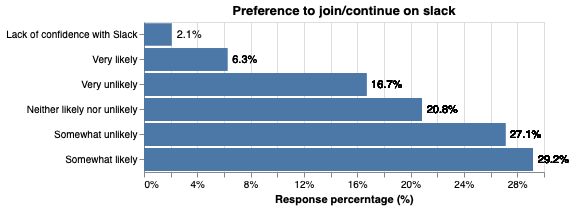
```


#### Q8: The Workshop content sustained my interest

```{r}
#| echo=FALSE, 
#| out.width = '75%'

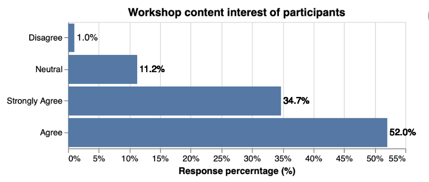
```

#### Q9: The Workshop content was easy to understand

```{r}
#| echo=FALSE, 
#| out.width = '75%'

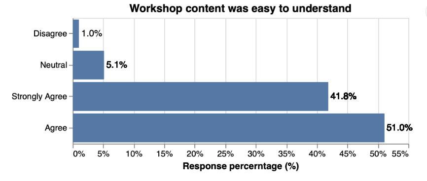
```

#### Q10: The Workshop content was relevant to my current job

```{r}
#| echo=FALSE, 
#| out.width = '75%'

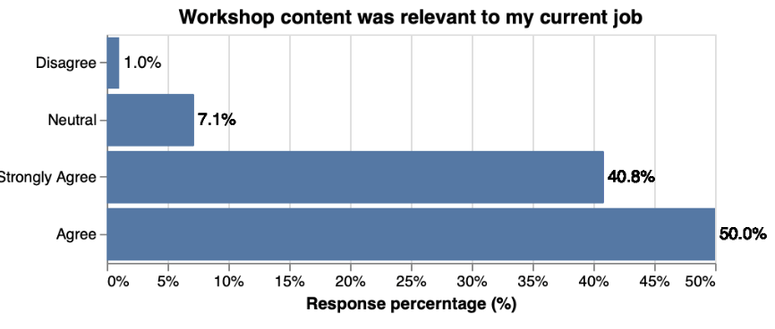
```

#### Q11: The Workshop content was relevant to my Organization

```{r}
#| echo=FALSE, 
#| out.width = '75%'

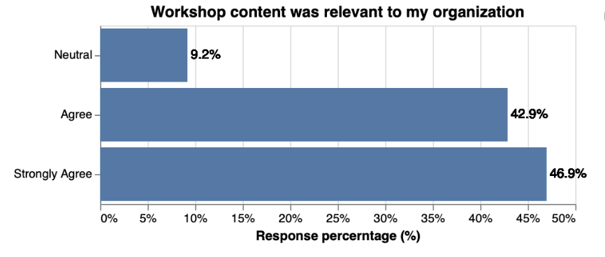
```

#### Q12: The optional and/or recommended practice exercises helped me understand the Workshop content

```{r}
#| echo=FALSE, 
#| out.width = '75%'

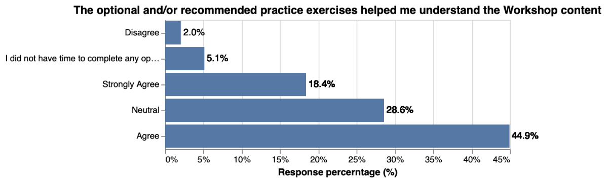
```

#### Q13: I will be able to apply the knowledge received from these Workshop sessions in my role or future projects

```{r}
#| echo=FALSE, 
#| out.width = '75%'

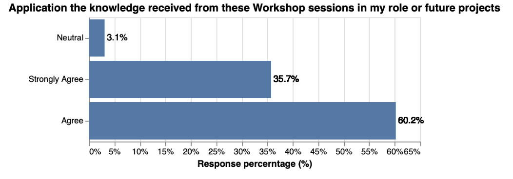
```

#### Q14: How would you rate the amount of content shared during these four 90 minute sessions?

```{r}
#| echo=FALSE, 
#| out.width = '75%'

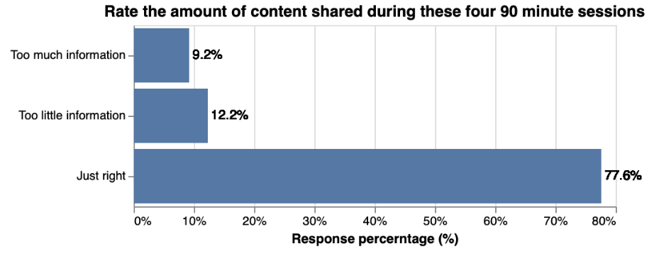
```

#### Q15: Facilitator was well prepared
```{r}
#| echo=FALSE, 
#| out.width = '75%'

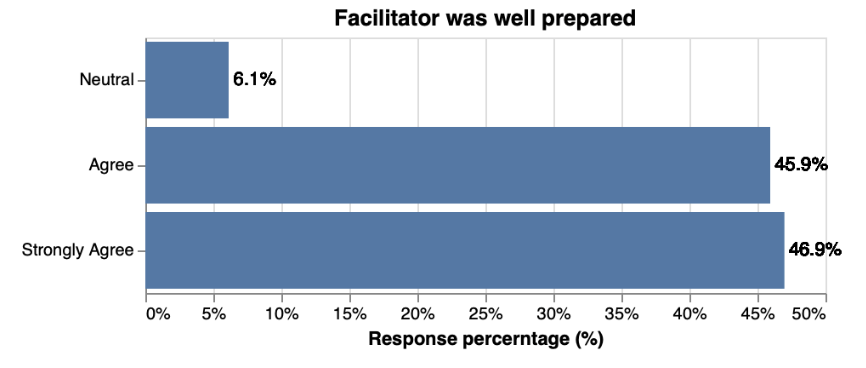
```

#### Q16: Facilitator was able to answer my questions

```{r}
#| echo=FALSE, 
#| out.width = '75%'

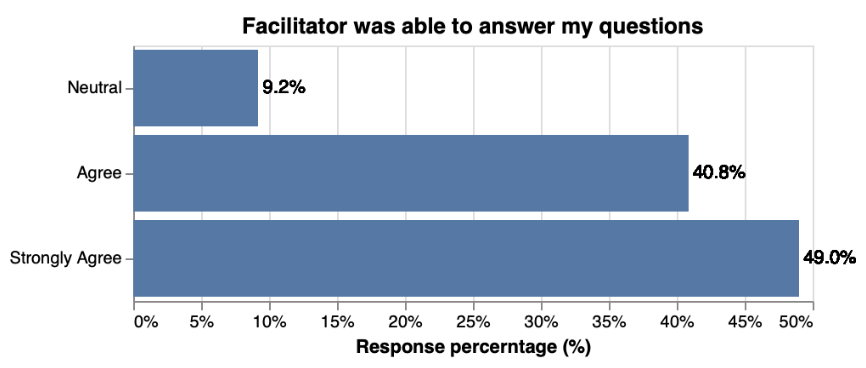

```

#### Q17: Facilitator provided real world experience

```{r}
#| echo=FALSE, 
#| out.width = '75%'

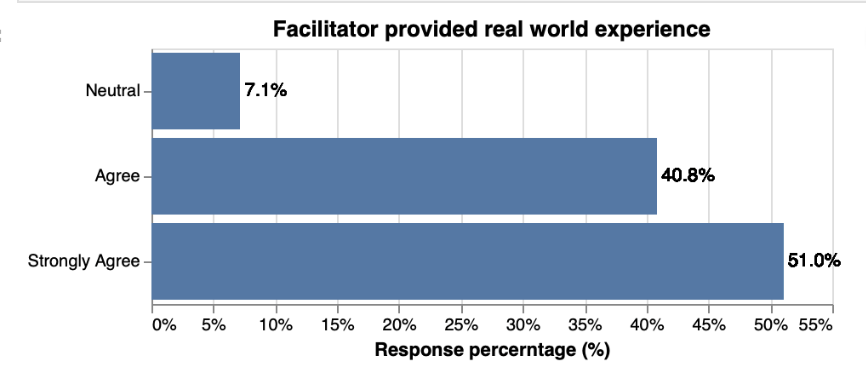
```

#### Q18: Facilitator possessed knowledge of the subject matter

```{r}
#| echo=FALSE, 
#| out.width = '75%'

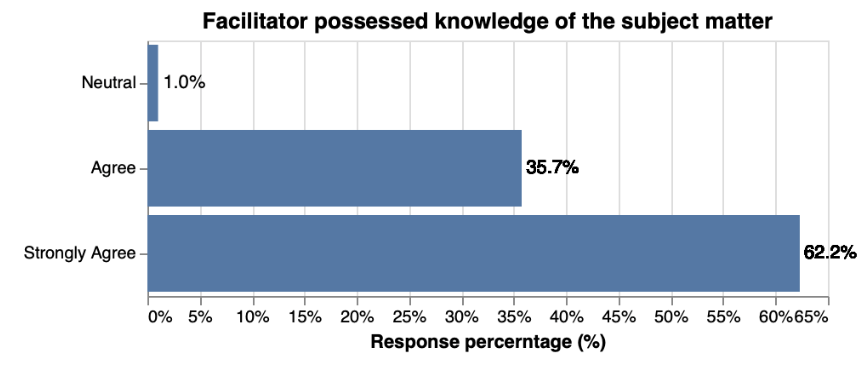
```

#### Q19: Facilitator was able to hold my attention¶

```{r}
#| echo=FALSE, 
#| out.width = '75%'

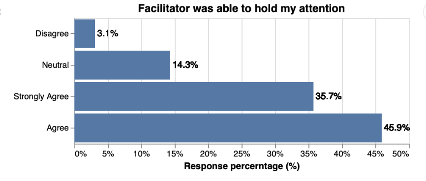
```


