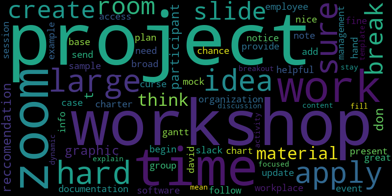
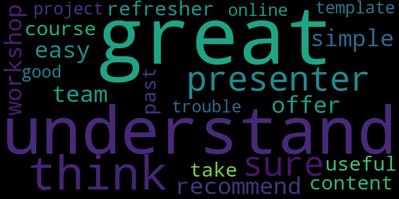
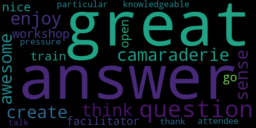
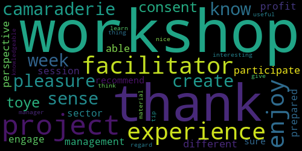

```{r setup, include=FALSE}
knitr::opts_chunk$set(echo = FALSE)
library(knitr)
library(kableExtra)
library(tidyverse)
```


## Overview 

This report contains visualizations of open-text survey questions from Post WS Survey questionnaire. The statistics shown here reflect response from 13 participants who responded to the post-workshop survey.  

### Content-based questions:  

#### Q8: Please describe any recommendations for improvements to this Online Workshop Session?

```{r q1}
#| echo=FALSE, 
#| out.width = '75%'


```


```{r}
table5 <- read_csv("../results/tables/LDA_8.csv") |>
  suppressMessages() 
  
kable(table5, 
      caption = "Common topics related to recommendations on online workshop session", 
      align = "ll") |> kable_styling(font_size = 13)
```


#### Q9: Please share any other comments relating to this Online Workshop content¶   

```{r q2}
#| echo=FALSE, 
#| out.width = '75%'


```

```{r}
table7 <- read_csv("../results/tables/LDA_9.csv") |>
  suppressMessages() 
  
kable(table7, 
      caption = "Common topics from online workshop content related comments", 
      align = "ll") |> kable_styling(font_size = 13)
```


#### Q12: The "Introduction to Project Management for Non-Profits" workshop is a high-level overview of project management. We are in the process of planning future topics for online workshops.

```{r q3}
#| echo=FALSE, 
#| out.width = '75%'

knitr::include_graphics("../results/images/post_q12_wc.png")
```

```{r}
table9 <- read_csv("../results/tables/LDA_12.csv") |>
  suppressMessages() 
  
kable(table9, 
      caption = "Common topics from online workshop content related comments", 
      align = "ll") |> kable_styling(font_size = 13)
```


#### Q19: Additional comments relating to the Facilitator(s)?   

```{r q4}
#| echo=FALSE, 
#| out.width = '75%'


```


```{r}
table11 <- read_csv("../results/tables/LDA_19.csv") |>
  suppressMessages() 
  
kable(table11, 
      caption = "Common topics related to comments about facilitators", 
      align = "ll") |> kable_styling(font_size = 13)
```


```{r}
table12<- read_csv("../results/tables/sent_analysis.csv") |>
  suppressMessages() 
  
kable(table12, 
      caption = "Sentiment analysis of comments about workshop facilitators. A positive score between 0 and 1 indicates positive comments, and value between 0 and -1 relates to negative comments.", 
      align = "ll") |> kable_styling(font_size = 13)
```

#### Q20: Please describe any recommendations for SLACK that could help connect participants with each other and PMV Facilitators during this session?  

```{r q6}
#| echo=FALSE, 
#| out.width = '75%'

knitr::include_graphics("../results/images/post_q20_wc.png")
```


```{r}
table14<- read_csv("../results/tables/LDA_20.csv") |>
  suppressMessages() 
  
kable(table14, 
      caption = "Common topics related to slack recoomendations", 
      align = "ll") |> kable_styling(font_size = 13)
```


#### Q22: As a volunteer-based organization, PMV does not have an advertising budget so we are always looking for personal comments we can use on our website or social media.

```{r q7}
#| echo=FALSE, 
#| out.width = '75%'


```


```{r q11}
table15<- read_csv("../results/tables/LDA_22.csv") |>
  suppressMessages() 
  
kable(table15, 
      caption = "Common topics related to comments regarding website or social media", 
      align = "ll") |> kable_styling(font_size = 13)
```

